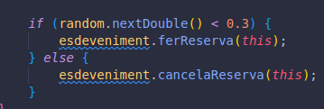
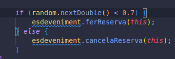

# Preguntes tècniques

## 1️ Per què s’atura l’execució al cap d’un temps?  
El programa s’atura després d’un temps perquè a la classe `Organitzador` s’ha definit una espera de 5 segons (`Thread.sleep(5000)`). Aquest temps permet que els assistents puguin fer reserves i cancel·lacions durant aquest interval. Un cop passats els 5 segons, el programa interromp tots els fils dels assistents amb el mètode `interrupt()` i finalitza l’execució. Això garanteix que el programa no es quedi executant-se indefinidament i que tots els assistents tinguin temps suficient per realitzar les seves accions abans de ser aturats.

*Figura 1: Diagrama que mostra com el programa s’atura després de 5 segons.*

---

## 2️ Què passaria si en lloc d’una probabilitat de **50%-50%** fora de **70% (ferReserva) - 30% (cancel·lar)?**  
Si canviem les probabilitats, el comportament del programa variarà significativament. En el cas de **70% ferReserva - 30% cancel·lar**, es faran més reserves que cancel·lacions, de manera que les places s’esgotaran més ràpidament i alguns assistents quedaran esperant fins que es cancel·li alguna reserva. D’altra banda, si invertim les probabilitats a **30% ferReserva - 70% cancel·lar**, es faran més cancel·lacions que reserves, de manera que hi haurà més places disponibles i menys assistents esperant.

  
 

---

## 3️ Per què creus que fa falta la llista i no valdria només amb una variable sencera de reserves?  
La llista `llistaAssistents` és necessària perquè permet gestionar les reserves i cancel·lacions de manera individual. Amb una variable sencera (`placesDisponibles`), podríem saber quantes places queden lliures, però no podríem identificar quins assistents han fet una reserva ni gestionar cancel·lacions concretes. La llista ens permet verificar si un assistent té una reserva abans de cancel·lar-la, eliminar-lo de la llista quan cancel·la, i notificar als assistents que estan esperant quan es lliura una plaça. Sense la llista, no podríem garantir aquesta gestió individual, cosa que és essencial per al correcte funcionament del programa.